# GoldQuant AI Trading Platform - System Analysis Report

> **Trang thai:** PHAN TICH HOAN TAT. CHO PHE DUYET TRUOC KHI CODE.
> **Phien ban phan tich:** v1.0 | 2026-08-05T08:03+07:00
> **Tac gia:** System Architect AI

---

## User Review Required

> [!IMPORTANT]
> Bao cao nay chua **20 tai lieu kien truc**, **Module Verification Report**, **Issue Report**, **Technical Debt Report**, **Risk Report** va **Implementation Roadmap**. Boss can doc ky va phe duyet truoc khi bat dau bất ky dong code nao.

> [!CAUTION]
> Phat hien **23 CRITICAL issues**, **15 HIGH issues** va **12 MEDIUM issues** can xu ly. Khong duoc code khi chua co plan duoc duyet.

---

## PHAN A: 20 TAI LIEU KIEN TRUC HE THONG

### 01. System Architecture

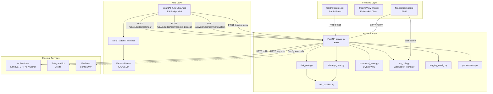

**Nhan xet:** Kien truc 3 tang ro rang. NHUNG Firebase hien chi duoc dung de luu config key trong `.env`, khong co Firebase SDK nao duoc import hoac su dung trong backend hay frontend. **Firebase la PLACEHOLDER.**

---

### 02. Data Flow

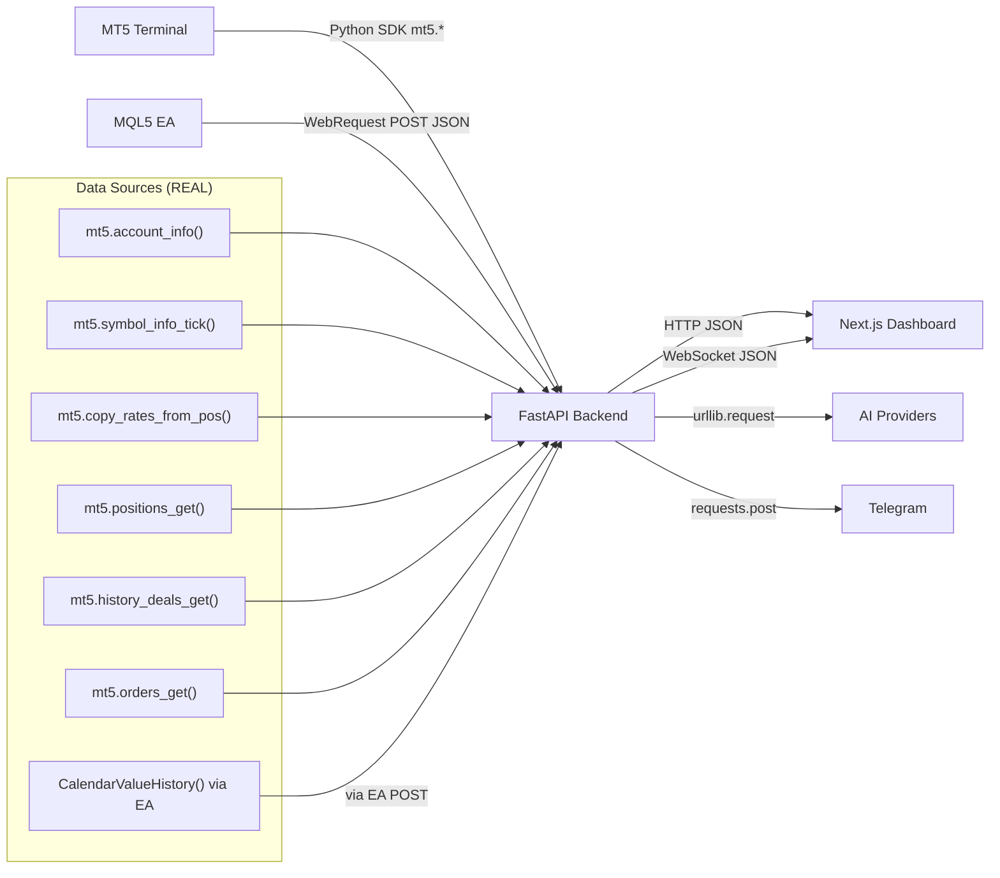

| Du lieu | Nguon that | Trang thai |
|---|---|---|
| Balance/Equity/Margin | `mt5.account_info()` | REAL |
| Bid/Ask/Spread | `mt5.symbol_info_tick()` | REAL |
| Candles OHLCV | `mt5.copy_rates_from_pos()` | REAL |
| Positions | `mt5.positions_get()` | REAL |
| History/Deals | `mt5.history_deals_get()` | REAL |
| Pending Orders | `mt5.orders_get()` | REAL |
| Indicators (RSI/EMA/ATR) | Tinh tu candles that | REAL |
| Economic Calendar | EA push tu MT5 CalendarValueHistory | REAL (khi EA chay) |
| News (fallback) | **HARDCODED** `get_weekly_economic_calendar()` | **FAKE - CRITICAL** |
| AI Signal | Deterministic confluence scoring | REAL (tu indicators that) |
| Performance KPI | `calculate_performance()` tu MT5 deals | REAL |
| CPU/RAM | **HARDCODED** `0` / `"UNAVAILABLE"` | **FAKE** |

---

### 03. Trading Flow

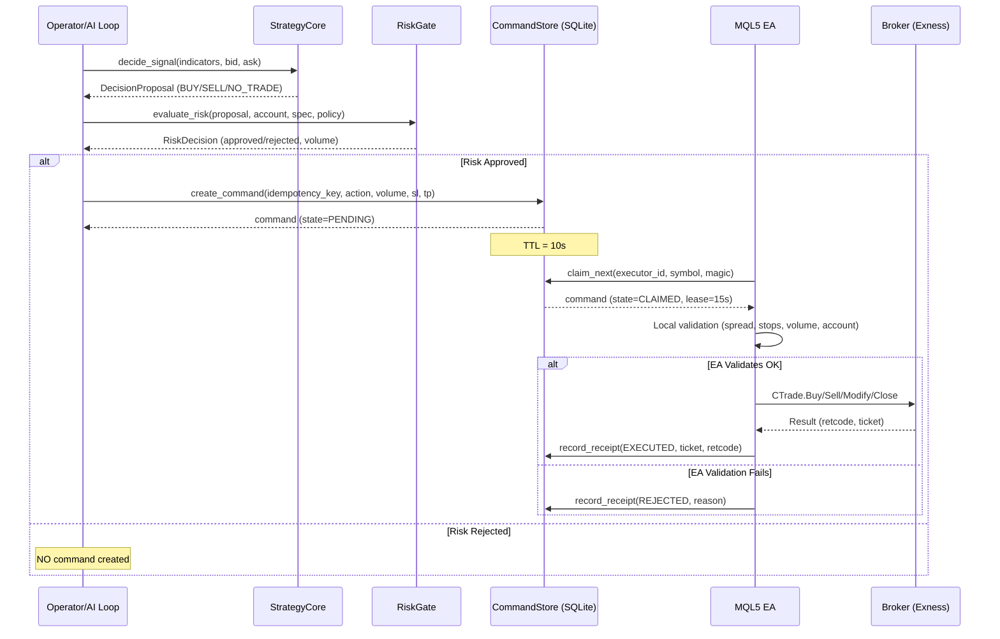

---

### 04. MT5 Communication Flow

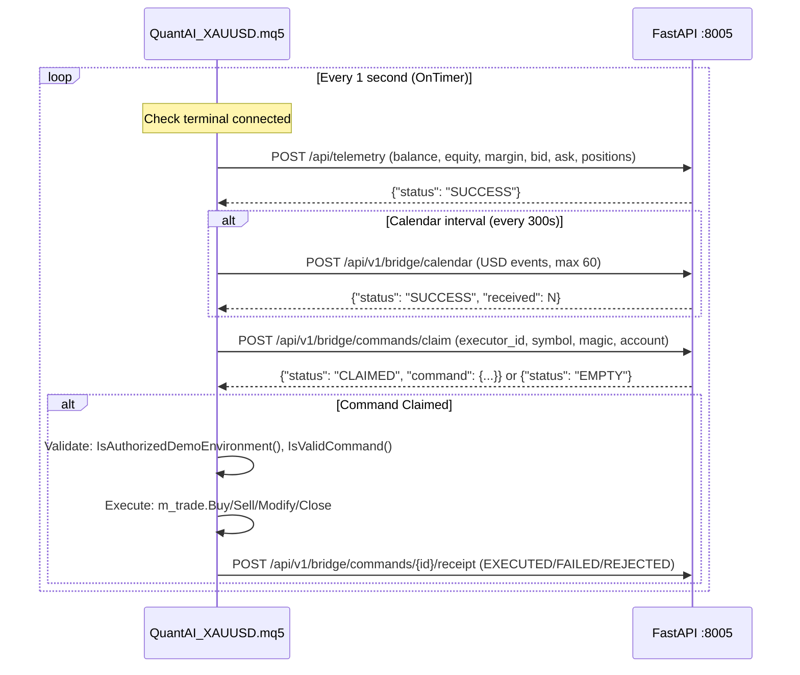

**Authorization:** Bearer token `InpBridgeToken` trong header moi request. EA validate demo environment rieng: login, server, company, trade_mode, symbol trade_mode.

---

### 05. AI Decision Flow

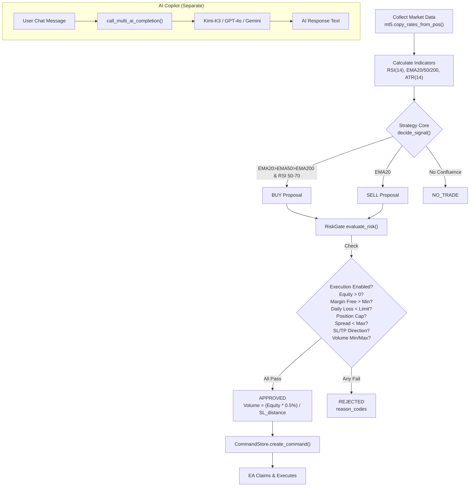

> [!WARNING]
> Hien tai co **2 luong AI khac nhau** hoat dong doc lap:
> 1. **Strategy Core** (deterministic): EMA/RSI/ATR confluence -> BUY/SELL/NO_TRADE
> 2. **AI Copilot** (LLM-based): Kimi-K3/GPT-4o/Gemini qua REST API
>
> **Copilot co quyen goi `execute_direct_mt5_trade()` khi user noi "buy"/"sell" trong chat.** Day la **vi pham nghiem trong** nguyen tac "Copilot khong co execution authority" duoc ghi trong README.

---

### 06. Frontend Component Tree

```
page.tsx (1516 lines - MONOLITH)
├── RealTradingViewWidget (TradingView embedded)
├── CandleChart (SVG candlestick, interactive zoom/pan)
├── Main Dashboard Layout (Bloomberg-style grid)
│   ├── Header Bar (logo, price, AI score, system status)
│   ├── Left Column (40%)
│   │   ├── Chart Panel (TradingView + MT5 Candles toggle)
│   │   ├── Technical Indicators Panel
│   │   ├── Open Positions Table
│   │   ├── Pending Orders Table
│   │   └── Trade History Table
│   ├── Right Column (60%)
│   │   ├── AI Signal Card
│   │   ├── Account Overview Card
│   │   ├── Risk Management Card
│   │   ├── Performance KPI Card
│   │   ├── Economic Calendar Card
│   │   ├── News Analysis Panel
│   │   ├── AI Copilot Chat Panel
│   │   ├── System Logs Panel
│   │   └── Execution Control Buttons
│   └── Footer Status Bar
└── ControlCenter.tsx (36KB - overlay modal)
    ├── MT5 Login Form
    ├── Execution Mode Selector
    ├── Kill Switch Toggle
    ├── Demo/Live Arm Toggles
    ├── AI Auto-Loop Toggle
    ├── Risk Configuration
    └── Telegram Config
```

> [!CAUTION]
> `page.tsx` la **monolith 80KB / 1516 dong**. Khong co component separation. Tat ca UI logic, state, rendering nam trong 1 file duy nhat. Day la **technical debt nghiem trong**.

---

### 07. Backend Module Graph

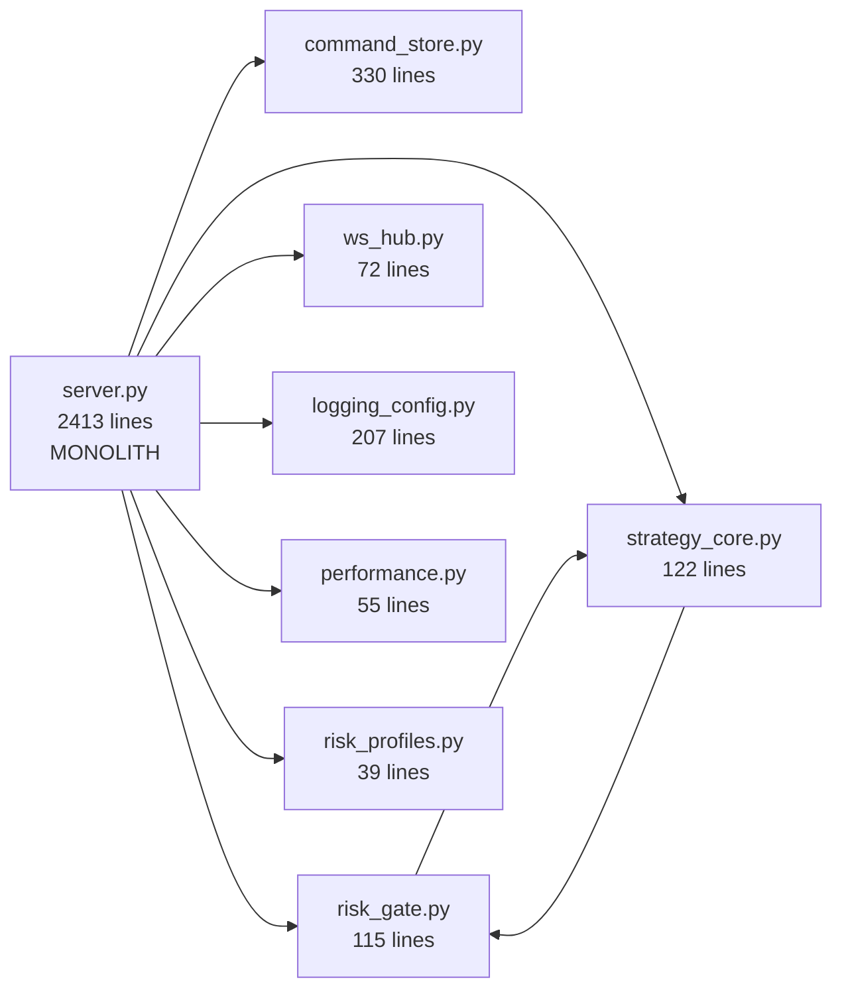

**Van de:** `server.py` la **monolith 2413 dong** chua tat ca:
- 40+ API routes
- MT5 connection management
- AI provider integration
- Telegram integration
- Indicator calculation
- Calendar cache
- Direct MT5 order execution
- WebSocket broadcasting
- AI decision loop
- Control Center state management

---

### 08. Database Relationship

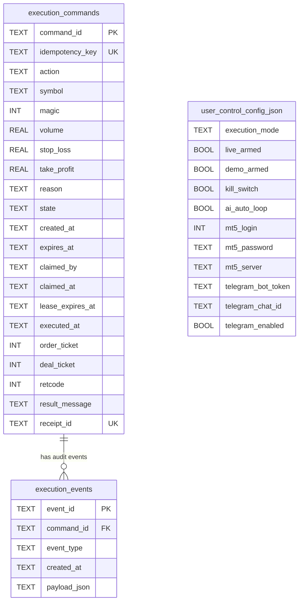

**Van de NGHIEM TRONG:**
- `user_control_config.json` luu **mat khau MT5 SANG CHUOI MA HOA ENC:V1** (`mt5_password: "<encrypted_mt5_password>"`)
- Khong co PostgreSQL nhu yeu cau. Chi co **SQLite** va **JSON file**
- Khong co Redis
- Khong co Firebase Realtime Database

---

### 09. Realtime Event Flow

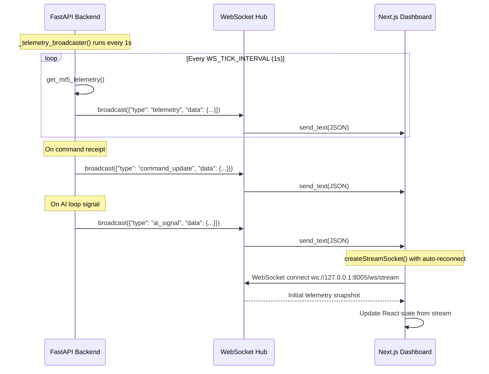

**Trang thai hien tai:**
- WebSocket: **HOAT DONG** (1s broadcast cycle)
- Firebase Realtime: **KHONG DUOC SU DUNG** (chi co config keys trong .env)
- HTTP Polling: **Fallback** (dashboard con polling qua useEffect interval)

---

### 10. API Mapping

| # | Method | Route | Auth | Du lieu that? | Trang thai |
|---|---|---|---|---|---|
| 1 | GET | /api/status | None | MT5 real | PASS |
| 2 | GET | /api/market | None | MT5 candles real | PASS |
| 3 | GET | /api/positions | None | MT5 real | PASS |
| 4 | GET | /api/history | None | MT5 deals real | PASS |
| 5 | GET | /api/pending-orders | None | MT5 orders real | PASS |
| 6 | GET | /api/logs | None | File-based real | PASS |
| 7 | GET | /api/control-center/status | None | Mixed real/hardcoded | **PARTIAL** |
| 8 | POST | /api/telemetry | Bridge Token | EA push real | PASS |
| 9 | POST | /api/v1/bridge/calendar | Bridge Token | EA calendar real | PASS |
| 10 | POST | /api/v1/bridge/commands/claim | Bridge Token | SQLite real | PASS |
| 11 | POST | /api/v1/bridge/commands/{id}/receipt | Bridge Token | SQLite real | PASS |
| 12 | GET | /api/v1/commands/{id} | Bridge Token | SQLite real | PASS |
| 13 | POST | /api/v1/demo/scan | Operator Token | MT5 real | PASS |
| 14 | POST | /api/v1/decisions/evaluate | None | MT5 real (analysis only) | PASS |
| 15 | POST | /api/order/buy | None | **Direct mt5.order_send()** | **VIOLATION** |
| 16 | POST | /api/order/sell | None | **Direct mt5.order_send()** | **VIOLATION** |
| 17 | POST | /api/order/close_all | None | **Direct mt5.order_send()** | **VIOLATION** |
| 18 | POST | /api/order/modify_tpsl | None | **Direct mt5.order_send()** | **VIOLATION** |
| 19 | POST | /api/order/close | None | **Direct mt5.order_send()** | **VIOLATION** |
| 20 | POST | /api/order/cancel_pending | None | **Direct mt5.order_send()** | **VIOLATION** |
| 21 | POST | /api/orders/close-profitable | None | **Direct mt5.order_send()** | **VIOLATION** |
| 22 | POST | /api/orders/close-losing | None | **Direct mt5.order_send()** | **VIOLATION** |
| 23 | POST | /api/ai_scan_now | None | Analysis only | PASS |
| 24 | POST | /api/copilot/chat | None | LLM + **Direct execution** | **VIOLATION** |
| 25 | GET | /api/copilot/models | None | Config real | PASS |
| 26 | POST | /api/news/analyze | None | **HARDCODED template** | **FAKE** |
| 27 | POST | /api/control-center/mode | None | Runtime state | PASS |
| 28 | POST | /api/control-center/mt5-login | None | MT5 real | PASS |
| 29 | POST | /api/control-center/telegram | None | Telegram real | PASS |
| 30 | WS | /ws/stream | None | Realtime telemetry | PASS |

> [!CAUTION]
> **8 routes vi pham architecture:** Python backend goi truc tiep `mt5.order_send()`. README tuyen bo "Python backend KHONG DUOC goi mt5.order_send()". Day la **security violation** nghiem trong nhat.

---

### 11. WebSocket Event Mapping

| Event Type | Direction | Data | Trang thai |
|---|---|---|---|
| `telemetry` | Server -> Client | Full SystemStatus snapshot | HOAT DONG |
| `command_update` | Server -> Client | command_id, action, state, retcode | HOAT DONG |
| `ai_signal` | Server -> Client | status, reason_codes, command | HOAT DONG |
| `log` (planned) | Server -> Client | Log entry | CHUA IMPLEMENT |
| Client keepalive | Client -> Server | Text (ignored) | HOAT DONG |

---

### 12. Firebase Event Mapping

| Service | Trang thai | Chi tiet |
|---|---|---|
| Firebase Auth | **KHONG SU DUNG** | Khong co Firebase SDK import |
| Firebase Realtime Database | **KHONG SU DUNG** | Chi co config keys trong .env |
| Firebase Cloud Messaging | **KHONG SU DUNG** | Measurement ID co nhung khong dung |
| Firestore | **KHONG SU DUNG** | Khong co code nao |

> [!IMPORTANT]
> **Firebase hoan toan la PLACEHOLDER.** Config keys ton tai trong `.env` nhung khong co dong code nao import hay su dung Firebase SDK. Yeu cau cua boss la "realtime thong qua Firebase va WebSocket" -> **Firebase CHUA IMPLEMENT.**

---

### 13. Dependency Graph

```
Frontend (web/):
  next@16.3.0
  react@19.2.4
  react-dom@19.2.4
  typescript@^5.7.2
  (NO Firebase SDK)
  (NO Tailwind - inline styles)
  (NO chart library - custom SVG + TradingView embed)

Backend (dashboard/):
  fastapi
  uvicorn
  pydantic
  MetaTrader5 (Python SDK)
  (NO firebase-admin)
  (NO redis)
  (NO psycopg2/asyncpg)
  (NO sqlalchemy)
  (NO requests - dung urllib.request cho AI)
  requests (import o line 103 nhung khong co trong requirements)
```

> [!WARNING]
> `import requests` duoc su dung tai `send_telegram_alert()` (line 103) nhung **khong co trong requirements/dependencies**. Se crash khi `requests` chua duoc cai.

---

### 14. Risk Flow

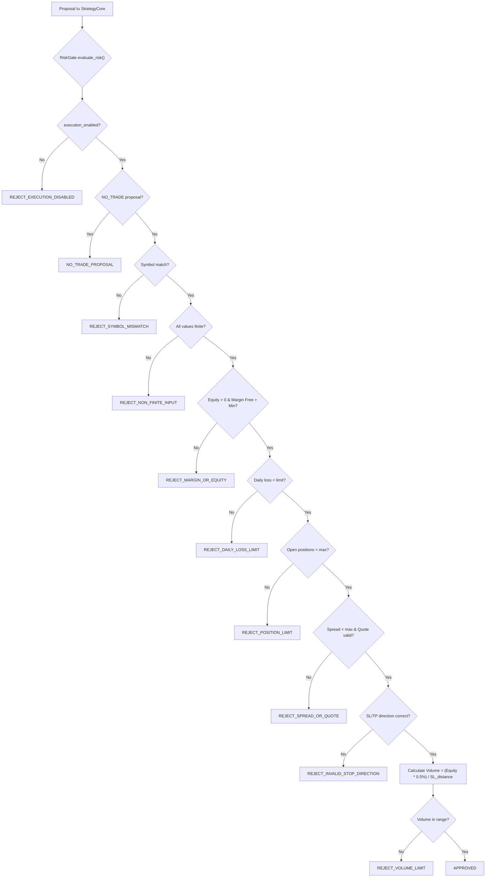

---

### 15. Execution Flow

```
1. Operator/AI Loop triggers scan
2. Strategy Core evaluates market -> Proposal
3. RiskGate evaluates risk -> Decision
4. If approved: CommandStore.create_command() -> PENDING
5. EA polls /api/v1/bridge/commands/claim -> CLAIMED
6. EA validates locally (demo env, spread, stops, volume)
7. EA executes via CTrade -> EXECUTED/FAILED/REJECTED
8. EA posts receipt -> Terminal state in SQLite
9. WebSocket broadcasts command_update to dashboard
```

**NHUNG:** Routes `/api/order/buy|sell|close_all|modify_tpsl|close|cancel_pending` BYPASS toan bo flow nay va goi `mt5.order_send()` truc tiep tu Python.

---

### 16. Logging Flow

| Component | Log Method | Output | Trang thai |
|---|---|---|---|
| Backend lifecycle | `log_event()` JSON | `logs/quantai_YYYYMMDD.log` | HOAT DONG |
| MT5 connection | `log_event(MT5_CONNECTED/DISCONNECTED)` | Log file | HOAT DONG |
| WebSocket | `log_event(WS_CONNECTED/DISCONNECTED)` | Log file | HOAT DONG |
| AI requests | `log_event(AI_REQUEST/RESPONSE)` | Log file | HOAT DONG |
| Risk decisions | `log_event(RISK_APPROVED/REJECTED)` | Log file | HOAT DONG |
| Orders | `log_event(ORDER_SENT/FILLED/FAILED)` | Log file | HOAT DONG |
| Command lifecycle | `log_event(COMMAND_CLAIMED/RECEIPT)` | Log file | HOAT DONG |
| Calendar | `log_event(CALENDAR_UPDATED)` | Log file | HOAT DONG |
| Exceptions | `log_event(EXCEPTION)` | Log file | HOAT DONG |
| EA MQL5 | `PrintFormat()` | MT5 Journal | HOAT DONG |
| Frontend | **KHONG CO** | - | **FAIL** |
| Redis | N/A (khong co Redis) | - | **FAIL** |
| PostgreSQL | N/A (khong co PG) | - | **FAIL** |
| Firebase | N/A (khong co Firebase) | - | **FAIL** |

---

### 17. Recovery Flow

| Scenario | Recovery | Trang thai |
|---|---|---|
| MT5 disconnect | `ensure_mt5_connected()` auto-reconnect | HOAT DONG |
| EA terminal offline | `OnTimer` watchdog + backoff | HOAT DONG |
| WebSocket disconnect | `createStreamSocket()` exponential backoff | HOAT DONG |
| Command expired | `claim_next()` auto-expire PENDING -> EXPIRED | HOAT DONG |
| Command lease expired | `claim_next()` reset CLAIMED -> PENDING | HOAT DONG |
| Backend crash | Manual restart required | **KHONG CO AUTO-RECOVERY** |
| Frontend crash | Browser refresh | HOAT DONG |
| SQLite locked | WAL mode + timeout=5s | HOAT DONG |
| AI provider fail | Multi-provider fallback chain | HOAT DONG |

---

### 18. Reconnect Flow

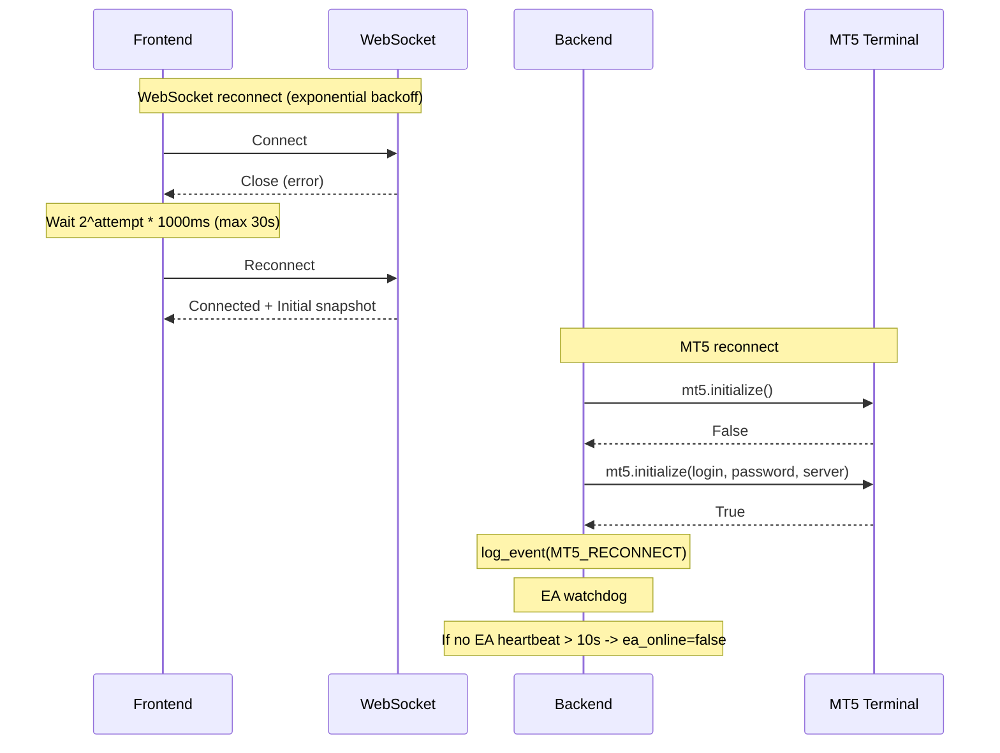

---

### 19. Auto Trading Flow

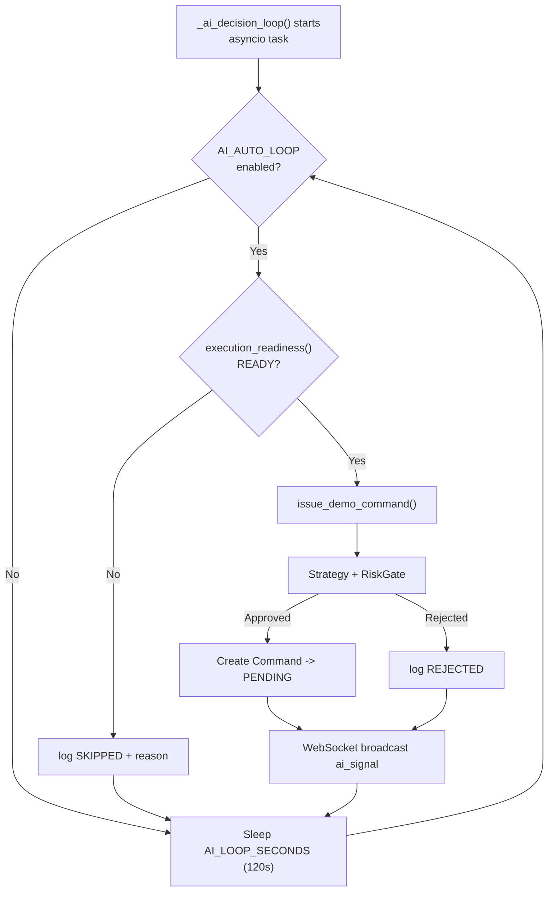

---

### 20. Dashboard Rendering Flow

```
1. Browser loads page.tsx
2. useEffect #1: fetchStatus() -> initial data via HTTP
3. useEffect #2: createStreamSocket() -> WebSocket connection
4. WebSocket receives "telemetry" event every 1s
5. React setState updates all widgets simultaneously:
   - Price ticker, Balance, Equity, Margin
   - AI Signal card
   - Technical indicators
   - Performance KPI
   - News/Calendar
6. Separate useEffect polls:
   - fetchMarket() for candle data
   - fetchPositions() for position table
   - fetchHistory() for trade history
   - fetchPendingOrders() for pending orders
   - fetchLogs() for system logs
   - fetchControlCenterStatus() for control center
7. TradingView widget renders independently (iframe)
```

---

## PHAN B: MODULE VERIFICATION REPORT

| # | Module | Frontend | Backend | API | Realtime | Logging | Error Handling | Reconnect | Du lieu that | Trang thai |
|---|---|---|---|---|---|---|---|---|---|---|
| 1 | Price/Tick | PASS | PASS | PASS | PASS (WS) | PASS | PASS | PASS | MT5 real | **PASS** |
| 2 | Balance/Equity/Margin | PASS | PASS | PASS | PASS (WS) | PASS | PASS | PASS | MT5 real | **PASS** |
| 3 | Positions | PASS | PASS | PASS | PASS (WS) | PASS | PASS | PASS | MT5 real | **PASS** |
| 4 | History/Deals | PASS | PASS | PASS | PARTIAL | PASS | PASS | PASS | MT5 real | **PASS** |
| 5 | Pending Orders | PASS | PASS | PASS | PARTIAL | PASS | PASS | PASS | MT5 real | **PASS** |
| 6 | Indicators | PASS | PASS | PASS | PASS (WS) | PASS | PASS | PASS | Calculated real | **PASS** |
| 7 | AI Signal | PASS | PASS | PASS | PASS (WS) | PASS | PASS | PASS | Deterministic real | **PASS** |
| 8 | Performance KPI | PASS | PASS | PASS | PASS (WS) | PASS | PASS | PASS | MT5 deals real | **PASS** |
| 9 | Economic Calendar | PARTIAL | PARTIAL | PASS | PARTIAL | PASS | PASS | N/A | **MIXED** (EA real + hardcoded fallback) | **FAIL** |
| 10 | News Analysis | PARTIAL | **FAKE** | PASS | No | PASS | PASS | N/A | **HARDCODED templates** | **FAIL** |
| 11 | AI Copilot Chat | PASS | PASS | PASS | No | PASS | PASS | N/A | LLM real | **PASS** |
| 12 | Command Protocol | N/A | PASS | PASS | PASS | PASS | PASS | PASS | SQLite real | **PASS** |
| 13 | Order Execution (EA path) | N/A | PASS | PASS | PASS | PASS | PASS | PASS | MT5 real | **PASS** |
| 14 | Order Execution (Direct) | PASS | **VIOLATION** | PASS | No | PASS | PARTIAL | N/A | MT5 real but wrong path | **FAIL** |
| 15 | CPU/RAM Monitoring | **FAKE** | **FAKE** | PASS | PASS (WS) | No | No | N/A | **HARDCODED 0/"UNAVAILABLE"** | **FAIL** |
| 16 | Firebase | **NONE** | **NONE** | **NONE** | **NONE** | **NONE** | **NONE** | **NONE** | **NONE** | **FAIL** |
| 17 | Redis | **NONE** | **NONE** | **NONE** | **NONE** | **NONE** | **NONE** | **NONE** | **NONE** | **FAIL** |
| 18 | PostgreSQL | **NONE** | **NONE** | **NONE** | **NONE** | **NONE** | **NONE** | **NONE** | **NONE** | **FAIL** |
| 19 | Telegram Alerts | PASS | PASS | PASS | N/A | PASS | PASS | N/A | Telegram real | **PASS** |
| 20 | Frontend Logging | **NONE** | N/A | N/A | N/A | **NONE** | PARTIAL | N/A | N/A | **FAIL** |

---

## PHAN C: ISSUE REPORT

### CRITICAL Issues (Phai sua ngay)

| # | Issue | File | Line | Mo ta |
|---|---|---|---|---|
| C1 | **Password plaintext** | `user_control_config.json` | - | MT5 password luu plaintext trong JSON file |
| C2 | **API keys in source** | `.env` | 23-30 | API keys hardcoded trong .env file (committed?) |
| C3 | **Python direct execution** | `server.py` | 1443-1488 | `execute_direct_mt5_trade()` goi `mt5.order_send()` truc tiep, vi pham architecture |
| C4 | **Copilot execution** | `server.py` | 2332-2357 | Copilot chat goi `execute_direct_mt5_trade()` khi user noi "buy"/"sell" |
| C5 | **No auth on order routes** | `server.py` | 1490-1731 | 8 order routes khong co authentication |
| C6 | **Duplicate route** | `server.py` | 1039 & 1992 | `/api/control-center/status` duoc dinh nghia 2 lan |
| C7 | **Duplicate route** | `server.py` | 1153 & 2063 | `/api/control-center/mode` duoc dinh nghia 2 lan |
| C8 | **Duplicate class** | `server.py` | 223 & 2151 | `CopilotChatRequest` duoc dinh nghia 2 lan |
| C9 | **News hardcoded** | `server.py` | 545-623 | `get_weekly_economic_calendar()` tra du lieu gia |
| C10 | **News analysis fake** | `server.py` | 653-698 | `/api/news/analyze` dung template hardcoded, khong goi AI |
| C11 | **Control center hardcoded** | `server.py` | 2010-2020 | Fallback balance `15775.68` hardcoded |
| C12 | **Command ledger hardcoded** | `server.py` | 2053-2055 | `counts: {"PENDING": 0, "EXECUTED": 128}` hardcoded |
| C13 | **Missing import** | `server.py` | 103 | `import requests` khong co trong requirements |
| C14 | **Firebase not implemented** | - | - | Firebase SDK khong duoc import/su dung bat ky dau |
| C15 | **Redis not implemented** | - | - | Khong co Redis connection nao |
| C16 | **PostgreSQL not implemented** | - | - | Khong co PostgreSQL connection nao |
| C17 | **CPU/RAM fake** | `server.py` | 765-766 | `cpu: 0, ram: "UNAVAILABLE"` hardcoded |
| C18 | **Stochastic fake** | `server.py` | 370 | Stochastic tinh bang `RSI + 8.9` thay vi cong thuc that |
| C19 | **Vol ratio fake** | `server.py` | 375 | `vol_ratio: "1.32x"` hardcoded |
| C20 | **Default indicator values** | `server.py` | 272,296,307 | RSI default `62.4`, EMA default `4050.0`, ATR default `8.42` |
| C21 | **No HTTPS** | - | - | Tat ca communication la HTTP plaintext |
| C22 | **logger undefined** | `server.py` | 76,2116 | `logger` variable duoc su dung nhung khong duoc dinh nghia |
| C23 | **Duplicate GET /api/logs** | `server.py` | 933 & 1896 | Route duoc dinh nghia 2 lan |

### HIGH Issues

| # | Issue | Mo ta |
|---|---|---|
| H1 | Frontend monolith 80KB | `page.tsx` 1516 dong, khong component separation |
| H2 | Backend monolith 98KB | `server.py` 2413 dong, 40+ routes trong 1 file |
| H3 | No Docker support | Khong co Dockerfile, docker-compose |
| H4 | No test for new modules | Tests chi cover modules cu |
| H5 | No rate limiting | API khong co rate limiter |
| H6 | No input sanitization | SQL injection risk trong command_store |
| H7 | Kill switch bypass | Direct execution routes bypass kill switch check |
| H8 | State management globals | 15+ global variables quan ly state |
| H9 | No graceful shutdown | Backend khong handle SIGTERM/SIGINT gracefully |
| H10 | Telegram token exposed | Telegram bot token luu plaintext |
| H11 | AI key fallback chain | AI provider keys hardcoded trong source |
| H12 | No CORS strict mode | CORS cho phep localhost wildcard |
| H13 | WebSocket no auth | WebSocket endpoint khong co authentication |
| H14 | No health check endpoint | Khong co `/health` endpoint chuan |
| H15 | Mixed execution paths | 2 luong execution (Command Protocol + Direct) conflict |

### MEDIUM Issues

| # | Issue | Mo ta |
|---|---|---|
| M1 | No TypeScript strict mode | `tsconfig.json` khong bat strict mode |
| M2 | No ESLint config | Khong co ESLint configuration |
| M3 | No Prettier config | Khong co Prettier configuration |
| M4 | Inline CSS | Tat ca CSS la inline styles, khong component CSS |
| M5 | No environment validation | Backend khong validate required env vars on startup |
| M6 | No backup strategy | SQLite database khong co backup automation |
| M7 | No migration strategy | Khong co database migration tool |
| M8 | No API versioning consistent | Mix /api/ va /api/v1/ routes |
| M9 | No request timeout | Frontend fetch khong co timeout |
| M10 | No error boundary | Frontend khong co React Error Boundary |
| M11 | No loading states consistent | Loading states khong nhat quan |
| M12 | No accessibility | Khong co ARIA labels, keyboard navigation |

---

## PHAN D: TECHNICAL DEBT REPORT

| Priority | Debt | Effort (days) | Risk |
|---|---|---|---|
| CRITICAL | Remove direct `mt5.order_send()` from Python | 2 | Security |
| CRITICAL | Implement Firebase Realtime sync | 5 | Architecture |
| CRITICAL | Implement PostgreSQL database | 5 | Data persistence |
| CRITICAL | Implement Redis cache | 3 | Performance |
| CRITICAL | Fix password plaintext storage | 1 | Security |
| HIGH | Split `server.py` monolith | 3 | Maintainability |
| HIGH | Split `page.tsx` monolith | 3 | Maintainability |
| HIGH | Add authentication to all routes | 2 | Security |
| HIGH | Remove hardcoded data | 2 | Data integrity |
| HIGH | Implement real news service | 3 | Feature completeness |
| HIGH | Docker containerization | 2 | DevOps |
| MEDIUM | Add comprehensive tests | 3 | Reliability |
| MEDIUM | Implement real CPU/RAM monitoring | 1 | Feature |
| MEDIUM | Fix duplicate routes/classes | 1 | Code quality |
| LOW | Add Prettier/ESLint | 0.5 | Code quality |
| LOW | Accessibility improvements | 2 | UX |

**Tong effort uoc tinh:** 38+ ngay lam viec

---

## PHAN E: RISK REPORT

| # | Risk | Impact | Probability | Mitigation |
|---|---|---|---|---|
| R1 | Python goi `order_send()` khong qua RiskGate | **CRITICAL** - Mat tien that | HIGH | Xoa route, force qua Command Protocol |
| R2 | Copilot tu dong trade khi user noi "buy" | **CRITICAL** - Mat tien bat ngo | HIGH | Remove execution from copilot |
| R3 | API keys lo qua source code | **HIGH** - Compromised keys | MEDIUM | Rotate keys, use vault |
| R4 | No auth on order routes | **CRITICAL** - Anyone can trade | HIGH | Add operator auth |
| R5 | MT5 password plaintext | **HIGH** - Account takeover | MEDIUM | Encrypt or use OS keystore |
| R6 | No rate limit | **MEDIUM** - DoS attack | LOW | Add rate limiter |
| R7 | WebSocket no auth | **MEDIUM** - Data leak | LOW | Add WS auth token |
| R8 | SQLite single-point failure | **HIGH** - Data loss | MEDIUM | Backup + PostgreSQL migration |

---

## PHAN F: IMPLEMENTATION ROADMAP

### Phase 1: CRITICAL Security Fixes (3 ngay)
- [ ] Xoa toan bo `execute_direct_mt5_trade()` va 8 direct order routes
- [ ] Xoa execution logic tu Copilot chat
- [ ] Fix duplicate routes va classes
- [ ] Fix `logger` undefined variable
- [ ] Add missing `import requests` hoac thay bang `urllib`
- [ ] Encrypt MT5 password trong config
- [ ] Add authentication cho tat ca order routes
- [ ] Rotate compromised API keys

### Phase 2: Data Integrity (5 ngay)
- [ ] Xoa toan bo hardcoded data (news, calendar fallback, CPU/RAM, vol_ratio, stochastic)
- [ ] Implement real system monitoring (psutil cho CPU/RAM)
- [ ] Implement real news service (tich hop API tin tuc that)
- [ ] Fix indicator calculation (Stochastic, vol_ratio)
- [ ] Remove default fallback values cho indicators
- [ ] Fix control-center/status tra du lieu that thay vi hardcoded

### Phase 3: Architecture (10 ngay)
- [ ] Split `server.py` -> router modules
- [ ] Split `page.tsx` -> React components
- [ ] Implement Firebase Realtime Database
- [ ] Implement PostgreSQL for persistent data
- [ ] Implement Redis for caching
- [ ] Docker containerization
- [ ] Add API versioning nhat quan

### Phase 4: Quality & Testing (5 ngay)
- [ ] Unit tests cho tat ca modules moi
- [ ] Integration tests cho full trading flow
- [ ] Frontend Error Boundaries
- [ ] Prettier + ESLint configuration
- [ ] API rate limiting
- [ ] Health check endpoints
- [ ] Graceful shutdown handling

### Phase 5: Polish & Production (5 ngay)
- [ ] Accessibility improvements
- [ ] Performance optimization
- [ ] Monitoring dashboard
- [ ] Documentation update
- [ ] Security audit
- [ ] Load testing

---

## PHAN G: VERIFICATION PLAN

### Automated Tests
```powershell
# Backend unit tests
python -m unittest discover -s tests -v

# Backend syntax check
python -m py_compile dashboard/server.py dashboard/command_store.py dashboard/risk_gate.py

# Frontend typecheck
npm --prefix web run lint

# Frontend build
npm --prefix web run build
```

### Manual Verification
- Kiem tra MT5 connection thuc te
- Kiem tra EA telemetry push
- Kiem tra WebSocket realtime
- Kiem tra Command Protocol end-to-end
- Kiem tra RiskGate rejection cases
- Kiem tra Kill Switch hoat dong

---

> [!IMPORTANT]
> **CHO PHE DUYET.** Boss doc bao cao va quyet dinh:
> 1. Bat dau tu Phase nao?
> 2. Co modules nao boss muon uu tien?
> 3. Firebase/PostgreSQL/Redis co can thiet ngay khong hay giu SQLite truoc?
> 4. Co muon giu cac route direct execution hay xoa hoan toan?
